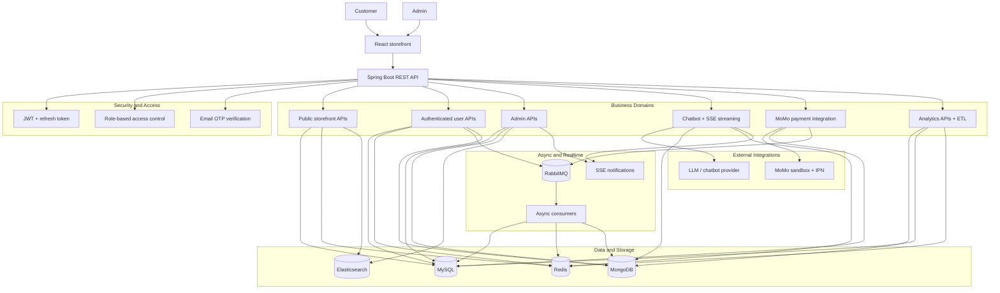

# E-commerce System

> **Author:** Phan Dinh Minh (Minzetsu)  
> **Last Updated:** March 20, 2026

Production-style full-stack e-commerce platform with customer, admin, realtime, analytics, and chatbot workflows. The codebase is structured as a monolith with clear domain boundaries, not a tutorial scaffold.

[](https://spring.io/projects/spring-boot)
[](https://react.dev/)
[](https://www.typescriptlang.org/)
[](https://www.mysql.com/)


## Snapshot

- **Frontend:** React 19, TypeScript, Vite, TailwindCSS, React Query, Zustand, React Router
- **Backend:** Spring Boot 3.5.7, Spring Security 6, JPA, Liquibase, RabbitMQ, SSE, Actuator
- **Data:** MySQL, Redis, Elasticsearch, MongoDB
- **Payments:** MoMo sandbox integration with IPN handling
- **Quality:** request IDs, structured logs, audit logs, health/metrics endpoints
- **Experience:** guest checkout, cart merge on login, role-based access, admin dashboard, support chatbot

## Highlights

- Covers the full commerce flow from discovery to checkout, payment, and post-order tracking.
- Separates transactional, search, cache, event, and archive storage by responsibility.
- Includes both storefront and admin dashboards, so the app demonstrates end-user and operator workflows.
- Adds realtime notifications, async processing, analytics, and chatbot interactions on top of the core store.

## Architecture



## Key Capabilities

### Customer Flow

1. Browse the home page, categories, products, and product details.
2. Search products with Elasticsearch-backed ranking and filtered listing.
3. Use guest cart or authenticated cart, then checkout with voucher support.
4. Complete payment through MoMo sandbox or guest payment flow.
5. Track orders, payment status, notifications, wishlist, recent views, and reviews.
6. Use the chatbot for support-style questions, conversation history, and streaming replies.

### Admin Flow

1. Manage products, categories, product images, banners, vouchers, and voucher usage.
2. Manage orders, order items, payments, users, roles, addresses, warehouses, and inventories.
3. Review analytics, audit logs, notifications, and reviews.
4. Reindex search data when needed and inspect operational state through dashboards and APIs.

### Domain Map

| Domain | Scope |
| --- | --- |
| auth | Register, OTP verification, login, refresh token |
| user | Profile, address book, account maintenance |
| product | Product/category catalog, images, homepage data |
| cart | Guest cart, user cart, merge-on-login behavior |
| order | Order lifecycle, guest checkout, voucher discount, guest order access |
| payment | Payment records, MoMo create flow, IPN callback, admin payment views |
| inventory | Warehouses, inventories, reservation and release logic |
| promotion | Banners, vouchers, voucher usage |
| review | Product reviews for users and moderation views for admin |
| activity | Wishlist and recent-view tracking |
| search | Admin reindex support and search pipeline integration |
| notification | User/admin notifications and realtime delivery |
| realtime | SSE endpoints for public, user, and admin streams |
| chatbot | Support assistant, project/group conversation model, streaming, translation, file/voice inputs |
| analytics | Funnel and top-product reporting, ETL, realtime counters |
| messaging | RabbitMQ domain events and consumers |
| common | Security, caching, rate limiting, audit logging, exception handling, health checks |

## Frontend Structure

### Storefront Routes

- Home, categories, products, product detail
- Cart, checkout, guest order lookup
- Login, register, role selection
- Profile, profile edit, password, addresses
- My vouchers, voucher details, voucher usage history
- Wishlist, notifications, orders, order detail, MoMo QR payment

### Admin Routes

- Dashboard home
- Products, categories, product images
- Orders, order items, payments
- Analytics, users, roles, addresses
- Warehouses, inventories, banners, vouchers, voucher uses
- Notifications, audit logs, reviews
- Profile, profile edit, password

## API Namespace Convention

- Public storefront: `/api/public/**`
- Authentication: `/api/auth/**`
- User-scoped: `/api/users/me/**`
- Admin: `/api/admin/**`

Swagger / API docs:

- `http://localhost:8080/docs`
- `http://localhost:8080/swagger-ui/index.html`
- `http://localhost:8080/v3/api-docs`

## Tech Stack

### Backend

- Spring Boot 3.5.7
- Spring Security 6
- Spring Data JPA
- Liquibase
- MySQL 8
- Redis
- RabbitMQ
- Elasticsearch
- MongoDB
- OpenAPI / Swagger
- Testcontainers
- Resilience4j

### Frontend

- React 19
- TypeScript
- Vite
- TailwindCSS
- React Query
- Zustand
- React Router
- shadcn-style UI primitives

## Local Development

### Prerequisites

- JDK 21
- Node.js 18+
- Docker and Docker Compose

### Recommended: Docker Compose

This spins up MySQL, Redis, RabbitMQ, Elasticsearch, MongoDB, backend, frontend, and ngrok.

```bash
docker compose up --build -d
docker compose down
```

Backend: `http://localhost:8080`  
Frontend: `http://localhost:5173`

### Backend Only

```bash
cd backend
./mvnw spring-boot:run
```

Useful profiles:

- `SPRING_PROFILES_ACTIVE=dev`
- `SPRING_PROFILES_ACTIVE=prod`

### Frontend Only

Create `frontend/.env`:

```bash
VITE_API_BASE_URL=http://localhost:8080
```

Run:

```bash
cd frontend
npm install
npm run dev
```

## Environment Variables

Common deployment variables:

- `DB_URL`, `DB_USERNAME`, `DB_PASSWORD`
- `JWT_SECRET_KEY`
- `REDIS_HOST`, `REDIS_PORT`
- `RABBITMQ_HOST`, `RABBITMQ_PORT`, `RABBITMQ_USERNAME`, `RABBITMQ_PASSWORD`
- `ELASTICSEARCH_URIS`
- `MOMO_PARTNER_CODE`, `MOMO_ACCESS_KEY`, `MOMO_SECRET_KEY`, `MOMO_ENDPOINT`, `MOMO_REDIRECT_URL`, `MOMO_IPN_URL`
- `MAIL_USERNAME`, `MAIL_PASSWORD`
- `CHATBOT_ENABLED`, `CHATBOT_PROVIDER`, `CHATBOT_BASE_URL`, `CHATBOT_API_KEY`, `CHATBOT_MODEL`
- `GUEST_CHECKOUT_USERNAME`, `GUEST_CHECKOUT_EMAIL`, `GUEST_CHECKOUT_PASSWORD`, `GUEST_CHECKOUT_ACCESS_TOKEN_SECRET`

If no chatbot provider is available, keep `CHATBOT_ENABLED=false`.

## Database And Runtime Notes

- Liquibase master changelog: `backend/src/main/resources/db/changelog/db.changelog-master.xml`
- Default MySQL schema is managed through migrations, not `ddl-auto`.
- Public APIs use cache headers and Redis-backed caching where appropriate.
- Checkout uses idempotency, inventory reservation TTL, and abuse protection.
- Analytics ETL materializes `clickstream_events` from Mongo into `daily_product_metrics` in MySQL.

## Documentation Map

- Frontend notes: `frontend/README.md`
- Frontend endpoint coverage: `frontend/docs/ENDPOINT_COVERAGE.md`
- Analytics docs: `docs/analytics/`
- Performance docs: `docs/perf/`
- Operations docs: `docs/ops/`
- Roadmap and phase tracking: `docs/roadmaps/PROJECT_PLAN.md`

## Delivery Status

- Phase 1: backend and security foundation, completed.
- Phase 2: frontend development, completed.
- Phase 3: performance and reliability, completed.
- Phase 4: search, realtime, messaging, chatbot, completed.
- Phase 5: quality, testing, and advanced data work, completed.
- Phase 6: analytics serving and ETL, completed.
- Phase 7: DevOps, observability, and scale, in progress.

This repository is a strong reference for production-style full-stack commerce work: transactional data in MySQL, cache/search/event storage split by responsibility, and a frontend that exercises customer and admin operations end to end.
