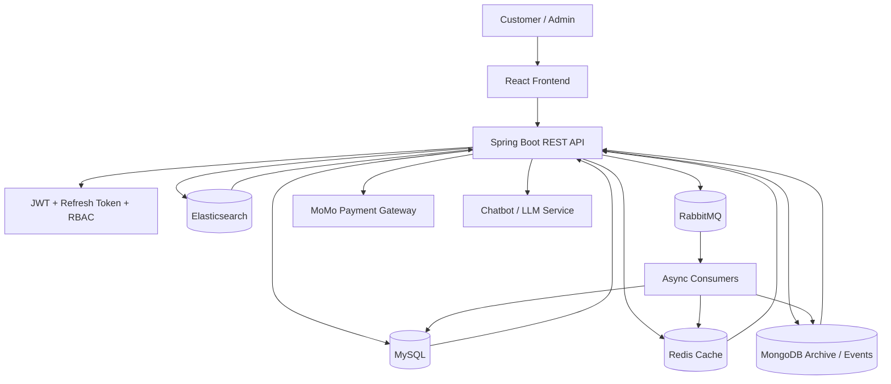

# E-commerce System

> **Author:** Phan Dinh Minh (Minzetsu)  
> **Last Updated:** March 20, 2026

Full-stack e-commerce platform built with Spring Boot and React. The project focuses on a realistic production-style workflow: authentication, product discovery, cart and checkout, payment integration, asynchronous order processing, realtime updates, search, analytics, and admin operations.

## Project Snapshot

- **Frontend:** React + TypeScript + Vite + TailwindCSS
- **Backend:** Spring Boot 3.5, Spring Security, JPA, Liquibase, SSE realtime, RabbitMQ
- **Data:** MySQL as system of record, Redis for caching, Elasticsearch for product search, MongoDB for event/log/archive data
- **Payments:** MoMo sandbox integration
- **Observability:** structured logs, request tracing, audit logs, actuator endpoints
- **Experience:** guest checkout, anonymous cart merge on login, role-based access, admin dashboard, chatbot assistant

## Architecture



## How It Works

1. The user browses products through the React frontend.
2. The frontend calls public or authenticated REST APIs depending on the page and role.
3. Login issues access and refresh tokens; the selected role determines whether the user sees the customer or admin experience.
4. Product search queries Elasticsearch, while transactional data stays in MySQL.
5. Add-to-cart, checkout, and payment steps run through the backend with validation, inventory reservation, and idempotency checks.
6. Payment confirmation and order state changes are processed asynchronously through RabbitMQ where needed.
7. Realtime notifications and status updates are delivered through SSE endpoints for users, admins, and chatbot streaming.
8. Analytics and log-style events are stored separately so the operational database stays focused on transactions.
9. The chatbot can use project/database context to answer support-style questions inside the app.

Implemented entry points include:

- Public storefront pages: home, categories, products, product detail, cart, checkout, guest order tracking, login, register.
- Authenticated user pages: profile, addresses, vouchers, voucher uses, wishlist, notifications, orders, MoMo QR payment.
- Admin pages: products, categories, product images, orders, order items, payments, analytics, users, roles, addresses, warehouses, inventories, banners, vouchers, voucher uses, notifications, audit logs, reviews, profile.

## Key Features

- **Authentication and authorization** with JWT, refresh tokens, role-based access control, and email OTP verification.
- **Shopping flow** with anonymous cart, merge-on-login behavior, vouchers, guest checkout, and guest order tracking.
- **Order lifecycle** with inventory reservation, TTL-based release, payment confirmation, and status tracking.
- **Search and discovery** with Elasticsearch-backed product search and ranking endpoints.
- **Realtime interactions** for notifications, order status, payment status, and chatbot streaming through SSE.
- **Admin capabilities** for catalog, orders, users, analytics, and operational dashboards.
- **Chatbot assistant** for contextual support.
- **Operational safety** through Liquibase migrations, structured logging, request IDs, and audit logging.

## Tech Stack

### Backend
- Spring Boot 3.5
- Spring Security 6
- Spring Data JPA
- Liquibase
- MySQL
- Redis
- RabbitMQ
- Elasticsearch
- MongoDB
- OpenAPI / Swagger
- Testcontainers

### Frontend
- React
- TypeScript
- Vite
- TailwindCSS
- shadcn-style UI primitives

## API Namespace Convention

- Public storefront: `/api/public/**`
- Auth: `/api/auth/**`
- User: `/api/users/me/**`
- Admin: `/api/admin/**`

## Local Setup

### Prerequisites

- JDK 21
- Node.js 18+
- MySQL 8.0
- Redis
- RabbitMQ
- Elasticsearch
- MongoDB

### Backend

```bash
cd backend
./mvnw spring-boot:run
```

Useful profiles:

- `SPRING_PROFILES_ACTIVE=dev`
- `SPRING_PROFILES_ACTIVE=prod`

Swagger / API docs:

- `http://localhost:8080/docs`
- `http://localhost:8080/swagger-ui/index.html`
- `http://localhost:8080/v3/api-docs`

### Frontend

Create `frontend/.env`:

```bash
VITE_API_BASE_URL=http://localhost:8080
```

Run:

```bash
cd frontend
npm install
npm run dev
```

Open `http://localhost:5173`

### Docker Compose

```bash
docker compose up --build -d
docker compose down
```

## Environment Variables

Recommended variables for deployment:

- `DB_URL`, `DB_USERNAME`, `DB_PASSWORD`
- `JWT_SECRET_KEY`
- `REDIS_HOST`, `REDIS_PORT`
- `RABBITMQ_HOST`, `RABBITMQ_PORT`, `RABBITMQ_USERNAME`, `RABBITMQ_PASSWORD`
- `ELASTICSEARCH_URIS`
- `MOMO_ACCESS_KEY`, `MOMO_SECRET_KEY`, `MOMO_IPN_URL`, `MOMO_REDIRECT_URL`
- `MAIL_USERNAME`, `MAIL_PASSWORD`
- `CHATBOT_PROVIDER`, `CHATBOT_BASE_URL`, `CHATBOT_API_KEY`, `CHATBOT_MODEL`

If no local LLM service is available, disable the chatbot or point it to a compatible provider through environment variables.

## Database Migration

Liquibase changelogs are managed from `backend/src/main/resources/db/changelog/db.changelog-master.xml`.

Notable schema areas include:

- core authentication and user management
- catalog, inventory, vouchers, and orders
- notification and audit-related records
- analytics mart tables for reporting

## Project Highlights

- Designed as a portfolio-ready full-stack product instead of a tutorial/demo app.
- Covers a realistic commerce lifecycle from browsing to payment and post-order tracking.
- Separates transactional data, search, cache, and event/archive storage for clearer system boundaries.
- Includes admin tooling and analytics so the project demonstrates both customer-facing and operational workflows.

## References

- Frontend-specific notes: `frontend/README.md`
- Analytics documentation: `docs/analytics/`
- Operations notes: `docs/ops/`
- Roadmaps: `docs/roadmaps/`
