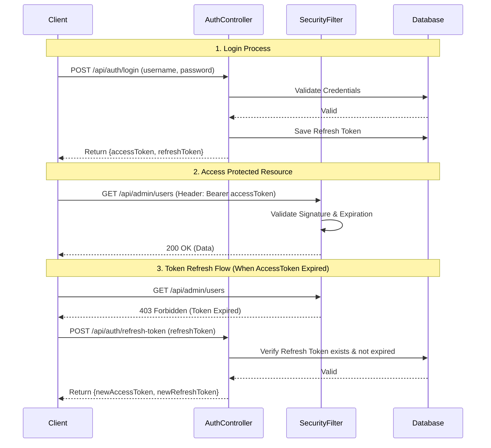
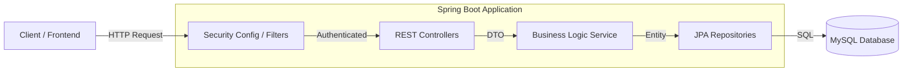

# 🛒 E-commerce Backend System (Phase 1: Core & Security)

> **Status:** Phase 1 Completed (Foundation, Advanced Security, Database Architecture)  
> **Author:** Phan Đình Minh (Minzetsu)  
> **Last Updated:** December 11, 2025

## 📖 Overview
This project is a robust, scalable backend for an E-commerce platform built with **Spring Boot 3** and **Spring Security 6**. 
Phase 1 focuses on establishing a solid architectural foundation, implementing advanced security standards (JWT, Refresh Token, RBAC), and setting up a comprehensive database schema managed by Liquibase.

## 🛠 Tech Stack
- **Core Framework:** Java 17, Spring Boot 3.x
- **Security:** Spring Security 6, JWT (jjwt), BCrypt
- **Database:** MySQL 8.0
- **Migration:** Liquibase (XML-based changelogs)
- **Documentation:** OpenAPI 3.0 (Swagger UI)
- **Tools:** Maven, Lombok, MapStruct, Docker (Planned)

---

## 🔐 Security Architecture (Highlight of Phase 1)
The system implements a **Stateless Authentication** mechanism designed for scalability and security.

### 1. Authentication Flow (JWT + Refresh Token)
We use a dual-token system to balance security and user experience.
- **Access Token (Short-lived):** Used to access protected resources. Expires quickly (e.g., 1 hour).
- **Refresh Token (Long-lived):** Stored in the database. Used to obtain a new Access Token without forcing the user to re-login.



### 2. Authorization (RBAC)
Access control is enforced at three layers:
1.  **Network Layer (CORS):** Configured to allow specific frontend origins (React/Vue/Angular).
2.  **URL Layer (SecurityConfig):**
    - `/api/admin/**` → Requires `ROLE_ADMIN`
    - `/api/users/**` → Requires `ROLE_USER`
    - `/api/products/**`, `/api/auth/**` → Public
3.  **Method Layer (@PreAuthorize):** Fine-grained control on Controllers.
    - Example: `@PreAuthorize("hasRole('ADMIN')")` on `AdminProductController`.

---

## 🏗 System Architecture

The project follows a standard **Layered Architecture** to ensure Separation of Concerns.



### Key Modules
| Module | Description | Status |
| :--- | :--- | :--- |
| **Auth** | Login, Register, Refresh Token, Logout | ✅ Completed |
| **User** | Profile, Address, Role Management | ✅ Completed |
| **Product** | CRUD Products, Categories, Images | ✅ Completed |
| **Order** | Order placement, Order Items, Status management | ✅ Completed |
| **Cart** | Add to cart, Update quantity, Remove item | ✅ Completed |
| **Inventory** | Warehouses, Stock management | ✅ Completed |
| **Promotion** | Vouchers, Banners | ✅ Completed |
| **Activity** | Wishlist, Recent Views, Search Logs | ✅ Completed |

---

## 🗄 Database Schema
The database is version-controlled using **Liquibase**.
- **Schema V1:** Core tables (`users`, `roles`, `refresh_tokens`) + E-commerce tables (`products`, `orders`, `carts`...).
- **Indexes:** Optimized for performance (e.g., `idx_refresh_tokens_user`).

---

## 🚀 How to Run

### Prerequisites
- JDK 17+
- MySQL 8.0
- Maven

### Steps
1.  **Clone the repository:**
    ```bash
    git clone https://github.com/minzetsu/ecommerce-backend.git
    ```
2.  **Configure Database:**
    Update `src/main/resources/application.properties`:
    ```properties
    spring.datasource.url=jdbc:mysql://localhost:3306/ecommerce
    spring.datasource.username=your_username
    spring.datasource.password=your_password
    ```
3.  **Run the application:**
    ```bash
    mvn spring-boot:run
    ```
4.  **Access Swagger UI:**
    Open `http://localhost:8080/swagger-ui/index.html` to explore and test APIs.
    - Use **Authorize** button to input the JWT Token.

---

## 📝 Next Steps (Phase 2: Frontend Development)
- [ ] **Setup & Architecture**: Initialize React/Vue/Angular project, Setup API Client (Axios/Fetch).
- [ ] **Customer Storefront**: Home Page, Product Search, Cart & Checkout Flow.
- [ ] **Admin Dashboard**: Product & Category Management, Order Processing.
- [ ] **Integration**: Connect Frontend with Backend APIs.

---
*Generated by GitHub Copilot & Minzetsu*
